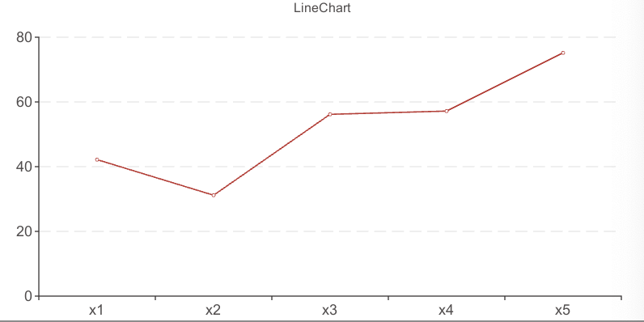
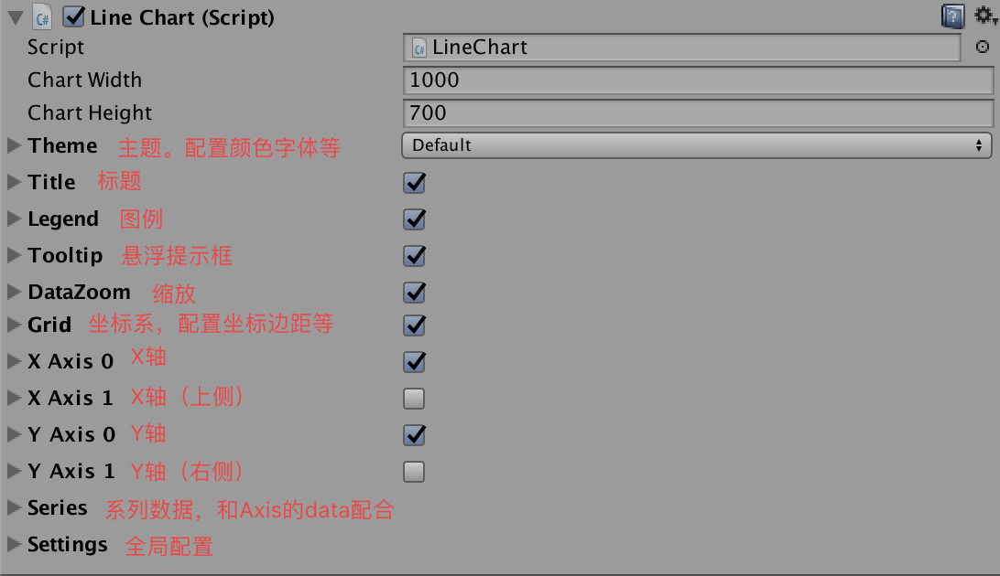
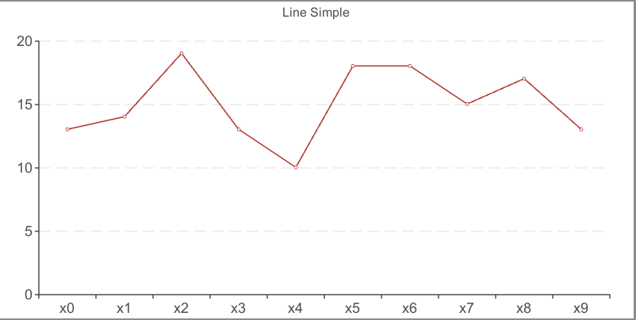

# 教程：5分钟上手XCharts

[返回首页](https://github.com/monitor1394/unity-ugui-XCharts)  
[XCharts问答](https://github.com/monitor1394/unity-ugui-XCharts/blob/master/Assets/XCharts/Documentation/XCharts问答.md)  
[XChartsAPI接口](https://github.com/monitor1394/unity-ugui-XCharts/blob/master/Assets/XCharts/Documentation/XChartsAPI.md)  
[XCharts配置项手册](https://github.com/monitor1394/unity-ugui-XCharts/blob/master/Assets/XCharts/Documentation/XCharts配置项手册.md)

## 获取和引入 XCharts

你可以通过以下几种方式获取 `XCharts`。

如果你只是想运行 `Demo` 查看效果，可以在 [Github](https://github.com/monitor1394/unity-ugui-XCharts)上的 [Clone or download](https://github.com/monitor1394/unity-ugui-XCharts/archive/master.zip)下载整个项目或去 [release](https://github.com/monitor1394/unity-ugui-XCharts/releases)下载稳定版本，将源码工程解压后用`unity`打开即可。

如果你要将 `XCharts` 加入你的项目中，可以在[Github](https://github.com/monitor1394/unity-ugui-XCharts)上下载最新的 [release](https://github.com/monitor1394/unity-ugui-XCharts/releases)稳定版本，这里一般会包含`XCharts`和`XChartsDemo`两个`unitypackage`，将 `XCharts` 通过 Unity 导入到你的项目中，`XChartsDemo` 是示例Demo，可视情况导入。或下载 Source code 解压后将内部的 `XCharts` 文件夹拷贝到你项目的 `Assets` 目录下。

如果你是`Unity 2018.3`及以上版本，可通过Package Manager来安装XCharts包，通过此方式导入的包只包含`XCharts`核心部分，不包含`XChartsDemo`示例`Demo`部分。具体操作步骤如下：

 1. 打开`Packages`目录下的`manifest.json`文件，在`dependencies`下加入：

``` json
     "com.monitor1394.xcharts": "https://github.com/monitor1394/unity-ugui-XCharts.git#package",
```

 2. 回到`Unity`，可能会花3到5分钟进行下载和编译，成功后就可以开始使用`XCharts`了。
 3. 如果要删除`XCharts`，删除掉1步骤所加的内容即可。
 4. 如果要更新`XCharts`，删除`manifest.json`文件的`lock`下的`com.monitor1394.xcharts`相关内容即会重新下载编译。在 `Component -> XCharts -> Check For Update`可以检测是否有新版本可更新。

## 添加一个简单图表

在`Hierarchy`试图下右键或菜单栏`GameObject`下拉：`XCharts->LineChart`：


即可快速创建一个简单的折线图出来：



在 `Inspector` 视图下可以调整各个组件的参数，`Game` 视图会实时反馈调整的效果。各个组件的详细参数说明可查阅[XCharts配置项手册](XCharts配置项手册.md)。



## 如何快速调整参数

 * 首先要理解：`XCharts`是配置参数驱动。想要什么效果，你只需要去调整对应组件下的配置参数就可以，不需要去改`Hierarchy`试图下的节点，因为那些节点是由`XCharts`内部根据配置参数生成的。你改了也会变还原。

 * 快速定位你想要改的效果对应的组件。这就需要对组件有一定的了解。比如我们想要让X轴的轴线末端显示箭头，第一步X轴定位到XAxis0，第二步轴线定位到AxisLine，然后我们再去看AxisLine有没有这样的参数可以实现这个效果。

 * `XCharts`提供从全局`Theme`、系列`Serie`、单个数据项`SerieData`全方位的参数配置。优先级从大到小为：`SerieData`->`Serie`->`Theme`。以`ItemStyle`的颜色例，如果`SerieData`的`ItemStyle`配置有颜色值，则优先用这个颜色值。判断是否配置有颜色值就是`Color.clear`（颜色的RGBA都是0）。

## 用代码添加折线图

给`gameObject`挂上`LineChart`脚本：

```C#
var chart = gameObject.GetComponent<LineChart>();
if (chart == null)
{
    chart = gameObject.AddComponent<LineChart>();
}
```

设置标题：

```C#
chart.title.show = true;
chart.title.text = "Line Simple";
```

设置提示框和图例是否显示：

```C#
chart.tooltip.show = true;
chart.legend.show = false;
```

设置是否使用双坐标轴和坐标轴类型：

```C#
chart.xAxises[0].show = true;
chart.xAxises[1].show = false;
chart.yAxises[0].show = true;
chart.yAxises[1].show = false;
chart.xAxises[0].type = Axis.AxisType.Category;
chart.yAxises[0].type = Axis.AxisType.Value;
```

设置坐标轴分割线：

```C#
chart.xAxises[0].splitNumber = 10;
chart.xAxises[0].boundaryGap = true;
```

清空数据，添加`Line`类型的`Serie`用于接收数据：

```C#
chart.RemoveData();
chart.AddSerie(SerieType.Line);
```

添加10个数据：

```C#
for (int i = 0; i < 10; i++)
{
    chart.AddXAxisData("x" + i);
    chart.AddData(0, Random.Range(10, 20));
}
```

这样一个简单的折线图就出来了：


如果一个Chart里面有多个系列时，则Axis的data只需要加一次，不要多个循环加重复了。记住：Axis的数据个数要和Serie的数据个数一致。

完整代码请查阅`Examples`：`Example13_LineSimple.cs`  

你还可以用代码控制更多的参数，`Examples`下还有更多的其他例子，凡是`Inspector`上看到的可配置的参数，都可以通过代码来设置。[XCharts配置项手册](XCharts配置项手册.md)里面的所有参数都是可以通过代码控制的。

另外，除非定制，建议调用[XChartsAPI接口](https://github.com/monitor1394/unity-ugui-XCharts/blob/master/Assets/XCharts/Documentation/XChartsAPI.md)  里面的接口，这些接口内部会做一些关联处理，比如刷新图表等。如果自己调用了内部组件的接口，需要自己处理刷新等其他问题。

[返回首页](https://github.com/monitor1394/unity-ugui-XCharts)  
[XCharts问答](https://github.com/monitor1394/unity-ugui-XCharts/blob/master/Assets/XCharts/Documentation/XCharts问答.md)  
[XChartsAPI接口](https://github.com/monitor1394/unity-ugui-XCharts/blob/master/Assets/XCharts/Documentation/XChartsAPI.md)  
[XCharts配置项手册](https://github.com/monitor1394/unity-ugui-XCharts/blob/master/Assets/XCharts/Documentation/XCharts配置项手册.md)
