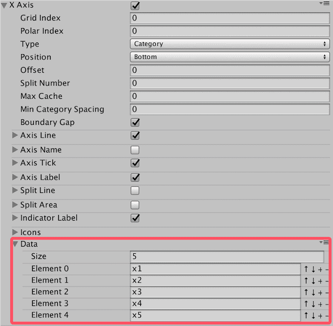
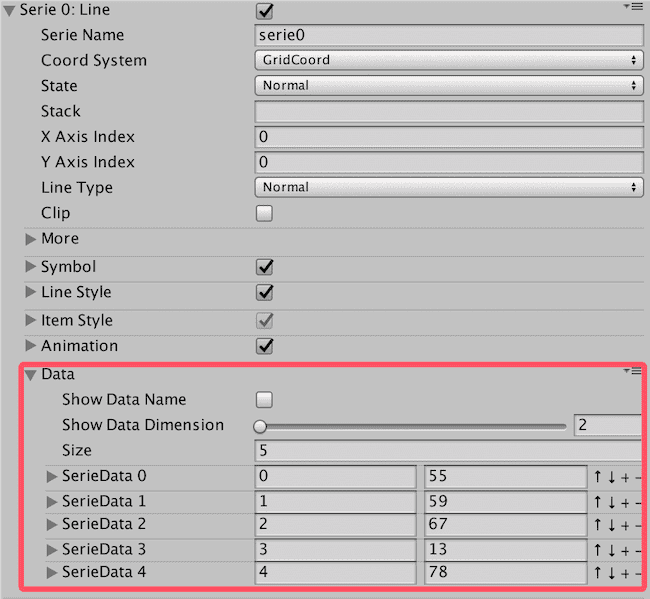
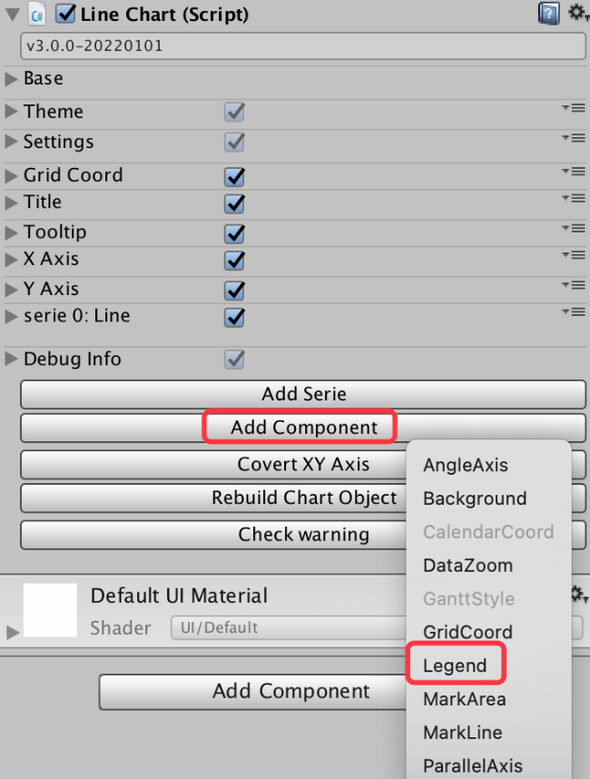
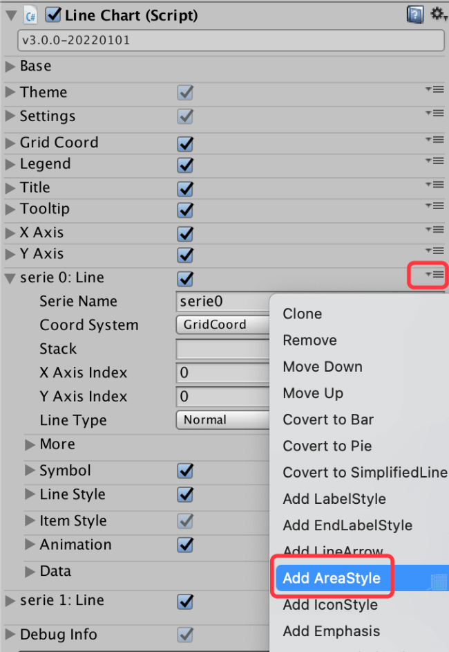
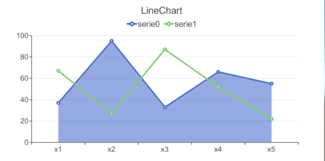

# Getting Started with XCharts in 5 Minutes

:::warning

Note: This tutorial is only applicable to the XCharts 3.x version. For the 2.x version, please refer to [Tutorial: Mastering XCharts 2.0](https://github.com/XCharts-Team/XCharts/blob/2.0/Doc/tutorial--get-start-with-xcharts-in-5-minute-EN.md)

:::

## Prerequisites for XCharts

XCharts is a Unity chart plugin, currently only available for use on the Unity platform.

Before using XCharts, you need to:

- Have a basic understanding of how to use Unity.
- Understand the basic usage of UGUI for making UI.
- Know how to use Unity's MonoBehavior scripts, how to attach scripts, and how to manipulate scripts with code.

If you are new to Unity, it is recommended to learn some basic Unity tutorials before using XCharts.

## Obtaining and Importing XCharts

XCharts is primarily maintained and released through Github. You can download the source code and Package from the [Github Homepage](https://github.com/XCharts-Team).

XCharts can be imported into your project in any of the following ways:

### Copying the XCharts Source Code Directly into the Project

After downloading the XCharts source code, simply copy the XCharts directory into the Assets directory of your Unity project. Once compiled, it is ready to use.

### Importing XCharts through Import Package

After downloading the .unitypackage file of XCharts, open Unity, go to the menu bar Assets-->Import Package-->select the downloaded .unitypackage to import. After the import is complete and compiled, you can start using XCharts.

### Importing XCharts through Package Manager

For Unity versions above 2018.3, you can import XCharts through the Package Manager. Open the Package Manager, then use `Add package from git URL...`, enter the GitHub URL of XCharts: `https://github.com/XCharts-Team/XCharts.git`. After compiling, you can use XCharts.

For some Unity versions, you can also directly add the package to the `manifest.json` file: Open the `manifest.json` file under the `Packages` directory, and add the following under `dependencies`:

>"com.monitor1394.xcharts": "https://github.com/XCharts-Team/XCharts.git",

If you need to update `XCharts`, delete the relevant content of `com.monitor1394.xcharts` under the `lock` of the `manifest.json` file (some Unity versions may be the packages-lock.json file), and it will re-download and compile.

### Recommended Import of XCharts Daemon

The daemon [XCharts-Daemon](https://github.com/XCharts-Team/XCharts-Daemon) ensures that the compilation is normal when updating. It is very useful when TextMeshPro or NewInputSystem is turned on locally. After importing XCharts-Daemon into the project, the daemon will automatically refresh XCharts' asmdef according to the local situation of TMP when updating XCharts, ensuring that the compilation is normal without manual intervention, which is convenient for automated processes such as CI/CD.

The import method of XCharts-Daemon can refer to the previous import method of XCharts. It can be imported into the project through source code or Package. The GitHub URL of XCharts-Daemon: https://github.com/XCharts-Team/XCharts-Daemon.git

## Basic Usage of XCharts

After importing XCharts and compiling, the XCharts menu will appear in the Unity editor's menu bar, and you can start using XCharts.

:::tip

Note: The XCharts menu in the Unity menu bar indicates that XCharts is available.

:::

### Adding a Simple Chart

In the `Hierarchy` view, right-click `UI->XCharts->LineChart` or select `LineChart` from the menu bar `XCharts` to quickly create a default line chart:


If you need to create a chart under a certain node, you can select the node and right-click `UI->XCharts->LineChart` to create a chart under the node.

### Modifying Chart Data

For the newly created chart, its data can be modified on the Inspector panel.

For X-axis data, you can add, delete, and modify by expanding: `XAxis->Data`:



For Serie data, you can add, delete, and modify by expanding: `Serie->Data`:



Serie supports multi-dimensional data, and generally, a line chart only uses two-dimensional data: the first dimension represents the ID of the X-axis category data, and the second dimension represents the corresponding value.

### Adding Multiple Series

In the `Inspector` view, find the `LineChart` panel, and click the `Add Serie` button to add a second `Line` line:


:::tip

Series are added through the `Add Serie` button. Different types of Series can be added. [What kinds of Series does XCharts have?](https://xcharts-team.github.io/en/docs/configuration#serie-系列)

:::

### Adding Other Main Components

By default, the chart does not have a `Legend`. If you need a `Legend` component, you can add it through the `Add Component` button:



:::tip

Main components are added through the `Add Component` button. [What main components does XCharts have?](https://xcharts-team.github.io/en/docs/configuration/#maincomponent-主组件) 

:::

### Adding Serie Components

Serie only comes with a few common components, and other components need to be added when used. For example, if you need to fill the area color for the line chart, you can add an `AreaStyle` component to `Serie` separately:




:::tip

Serie components are added through the button on the right side of Serie. [What components can be added to Serie in XCharts?](https://xcharts-team.github.io/en/docs/configuration/#iseriecomponent-可添加到serie的组件)

:::

### Adding SerieData Components

If you need to customize the configuration of each data item individually, you can add components to each `SerieData` separately. For example, we can display `Label` for the second data of the line chart individually:


:::tip

SerieData components are added through the button on the right side of SerieData after expanding. [What components can be added to SerieData in XCharts?](https://xcharts-team.github.io/en/docs/configuration/#iseriedatacomponent-可添加到seriedata的组件) 

:::

### More Components and Configuration Parameters

XCharts has been continuously iterated and optimized, and now has dozens of main components and sub-components, each with several to dozens of configurable parameters to support a variety of functions.

When using XCharts for the first time, it is recommended to personally test the actual effects of each chart, each component. The `Inspector` view can directly add various charts, components, and adjust various configuration parameters, and the `Game` view will provide real-time feedback on the adjustments. A detailed description of each component's parameters can be found in the [XCharts Configuration Manual](configuration.md).

### How to Quickly Adjust Parameters

XCharts is driven by data and parameters. To achieve the desired effect, simply adjust the configuration parameters under the corresponding component. Do not modify the nodes under the `Hierarchy` view, as those nodes are generated by XCharts internally based on configuration and data, and will be restored upon refresh.

To quickly locate the component corresponding to the effect you want to change, you need to have a certain understanding of the components. For example, we want to display an arrow at the end of the X-axis line. How to locate it? The first step, the X-axis is located at `XAxis0`; the second step, the axis line is located at `AxisLine`; finally, check if there is such a parameter under the `AxisLine` component to achieve this effect. If you are not sure about the parameters, you can refer to the [XCharts Configuration Manual](configuration.md).

`XCharts` provides comprehensive parameter configuration from the global `Theme`, series `Serie`, and individual data items `SerieData`. The priority order from high to low is: `SerieData`->`Serie`->`Theme`. Take the color of `ItemStyle` as
 an example:

1. If the `ItemStyle` of `SerieData` has a color value other than `0000`, this color value is used first.
2. If the `ItemStyle` of `Serie` has a color value other than `0000`, this color value is used.
3. Otherwise, the color value is taken from the `Color Palette` of the theme `Theme`.

:::tip

The color value is usually `0000` when using the default color of the theme; other parameters are `0` or null when using the default configuration of the theme; pay attention to transparency when setting colors.

:::

### Adding a Line Chart with Code

Attach the `LineChart` script to `gameObject`:

```csharp
var chart = gameObject.GetComponent<LineChart>();
if (chart == null)
{
    chart = gameObject.AddComponent<LineChart>();
    chart.Init();
}
```

Adjust the size:

```csharp
chart.SetSize(580, 300);//Dynamically set the size with code, or directly operate chart.rectTransform, or directly change it in the Inspector
```

Set the title:

```csharp
var title = chart.EnsureChartComponent<Title>();
title.text = "Simple Line";
```

Set whether to display the tooltip and legend:

```csharp
var tooltip = chart.EnsureChartComponent<Tooltip>();
tooltip.show = true;

var legend = chart.EnsureChartComponent<Legend>();
legend.show = false;
```

Set the coordinate axis:

```csharp
var xAxis = chart.EnsureChartComponent<XAxis>();
xAxis.splitNumber = 10;
xAxis.boundaryGap = true;
xAxis.type =  Axis.AxisType.Category;

var yAxis = chart.EnsureChartComponent<YAxis>();
yAxis.type =  Axis.AxisType.Value;
```

Clear all default data (including Series), add a `Line` type `Serie` to receive data:

```csharp
chart.RemoveData();
chart.AddSerie<Line>("line");
```

If the Serie is fixed, it is recommended to only clear the data, not to remove the Serie:

```csharp
chart.ClearData();
```

This way, you can set the configuration parameters of Serie in the UI in advance.

Add 10 data points:

```csharp
for (int i = 0; i < 10; i++)
{
    chart.AddXAxisData("x" + i);
    chart.AddData(0, Random.Range(10, 20));
}
```

Now, a simple line chart is ready:


If there are multiple series in a Chart, the data of Axis only needs to be added once, and should not be repeated in multiple loops.

:::tip

Remember: The number of Axis data should be consistent with the number of Serie data.

:::

For the complete code, please refer to `Examples`: `Example13_LineSimple.cs`  

You can also control more parameters with code. There are more examples in `Examples`. All parameters that can be configured in the `Inspector` can be set with code. All parameters in the [XCharts Configuration Manual](configuration.md) can be controlled by code.

### Setting the Default Font

The default font used by XCharts is Unity's default font `Arial`, which may not display Chinese characters on the WebGL platform. When using XCharts in your project, it is recommended to set the font first:

- Find the `XCharts/Resources/XCSetting.asset` resource and modify the `Font` inside and save.
- Find the `XCharts/Resources/XCTheme-Default.asset` and `XCharts/Resources/XCTheme-Dark.asset` font configurations, and click the `Sync Font from Setting` and `Sync Font to Sub Theme` buttons to synchronize the font to the theme configuration files.

After the font is set, newly created charts will use the newly set font. For old charts, you can click the `Rebuild Chart Object` button to refresh.

:::tip

It is recommended to set the font before using XCharts; when updating XCharts, pay attention to the potential restoration of the set font.

:::

### Using TextMeshPro

XCharts supports TextMeshPro, but it is not enabled by default and needs to be switched on manually. It can be turned on and off in the following ways:


After turning it on, you need to set the global font to be used by TextMeshPro, and it can also be set individually in the Theme:


It is recommended to plan whether to use TextMeshPro at the beginning of the project and set the font accordingly. When switching to TMP in a project with many charts, some charts may not refresh automatically, and you can manually click the `Rebuild Chart Object` button to rebuild the chart, which will initialize normally.

If you have enabled TMP in your project, you may encounter compilation failures due to lost TMP references when updating XCharts. This can be solved in the following two ways:

1. Find `XCharts.Runtime.asmdef` and `XCharts.Editor.asmdef`, and manually add references to `TextMeshPro`.
2. Remove the `dUI_TextMeshPro` macro from the `Scripting Define Symbols` in `PlayerSetting`.

After the `3.8.0` version, the [XCharts-Daemon](https://github.com/XCharts-Team/XCharts-Daemon) daemon was added. After importing XCharts-Daemon into the project, the daemon will automatically refresh the asmdef based on the local situation of the enabled TMP when updating XCharts, ensuring normal compilation.

## XCharts Code Control

All parameters seen in the `Inspector` can be modified with code. The key is to locate the parameter you want to change, whether it is on the component, the Serie, or the specific data item SerieData.

In addition, unless customized, it is recommended to call the `public` interfaces provided under `Chart`, especially for data-related and list operations. These interfaces will do some associated processing internally, such as refreshing the chart. Common interfaces include:

1. `chart.ClearData()`: Clear chart data (does not remove Series)
2. `chart.RemoveData()`: Clear chart data (will remove all Series)
3. `chart.AddSerie()`: Add Serie
4. `chart.AddXAxisData()`: Add X-axis data
5. `chart.AddData()`: Add Serie data
6. `chart.UpdateData()`: Update Serie data
7. `chart.UpdateXAxisData()`: Update X-axis data
8. `chart.UpdateDataName()`: Update the name of Serie data

XCharts has an automatic refresh mechanism, but it is also triggered under certain conditions. If you have called the internal component interfaces and encountered components that have not been refreshed, and you cannot find the reason, you can use the following two interfaces to force a refresh:

1. `chart.RefreshAllComponent()`: Refresh chart components, which will re-initialize all components. It is not recommended to use it frequently.
2. `chart.RefreshChart()`: Refresh chart rendering, which only refreshes the rendering part and will not refresh component text, position, etc.
3. Each component can also refresh itself by calling `SetAllDirty()`.

:::tip

Use APIs to manipulate data and various lists, not directly access the list for processing.

:::

### Changing Parameters on Main Components

You need to obtain the component first, then modify its parameters:

```csharp
var title = chart.EnsureChartComponent<Title>();
title.text = "Simple LineChart";
title.subText = "normal line";

var xAxis = chart.EnsureChartComponent<XAxis>();
xAxis.splitNumber = 10;
xAxis.boundaryGap = true;
xAxis.type = Axis.AxisType.Category;
```

:::tip

In older versions without the `EnsureChartComponent()` interface, use `GetOrAddChartComponent()`

:::

### Changing Serie Parameters

For newly added Series:

```csharp
var serie = chart.AddSerie<Pie>();
serie.center[0] = 0.5f;
serie.center[1] = 0.5f;
serie.radius[0] = 80;
serie.radius[1] = 90;
serie.animation.dataChangeEnable = true;
serie.roundCap = true;
```

For existing Series:

```csharp
var serie = chart.GetSerie<Pie>();
serie.center[0] = 0.5f;
serie.center[1] = 0.5f;
serie.radius[0] = 80;
serie.radius[1] = 90;
serie.animation.dataChangeEnable = true;
serie.roundCap = true;
```

Adding additional components to Serie:

```csharp
serie.EnsureComponent<AreaStyle>();

var label = serie1.EnsureComponent<LabelStyle>();
label.offset = new Vector3(0,20,0);
```

### Changing Parameters on Data Item SerieData

```csharp
var serieData = chart.AddData(0, 20);
//var serieData = serie.GetSerieData(0); //To get from existing data
serieData.radius = 10;

var itemStyle = serieData.EnsureComponent<ItemStyle>(); //Add ItemStyle component to the data item
itemStyle.color = Color.blue;

```
