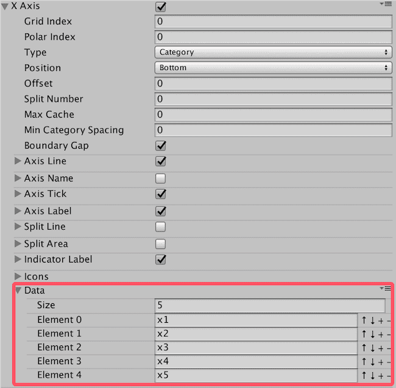
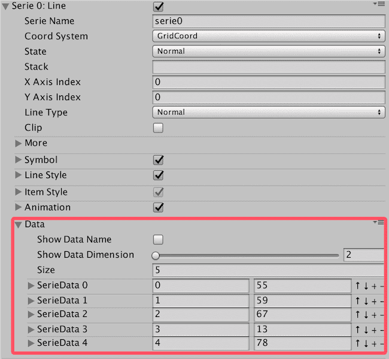
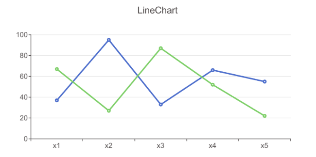
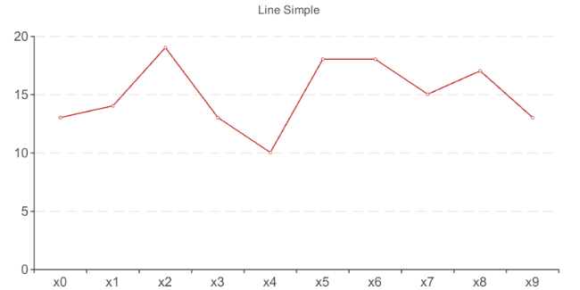
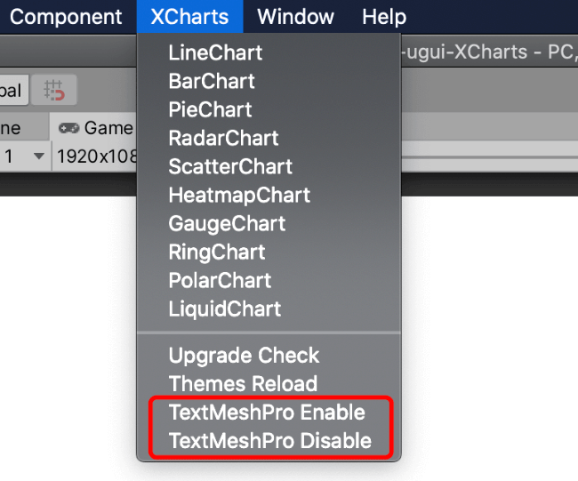

# 教程：5分钟上手 XCharts 3.0

:::warning

Note：本教程仅适用XCharts 3.x版本，2.x版本请看 [教程：5分钟上手XCharts 2.0](https://github.com/XCharts-Team/XCharts/blob/2.0/Doc/教程：5分钟上手XCharts.md)

:::

## XCharts的前提条件

XCharts是一个Unity图表插件，目前只能在Unity平台使用。

使用XCharts前，你需要：

- 掌握Unity的基本用法。
- 掌握UGUI制作UI的基本用法。
- 了解Unity的MonoBehavior脚本用法，知道怎么挂脚本和用代码操作脚本。

如果你刚接触Unity，建议先学习Unity相关的基础教程再使用XCharts。

## XCharts的获取和导入

XCharts主要通过Github来维护更新和发布，可以到[【Github主页】](https://github.com/XCharts-Team)进行下载获取源码和Pacakge；对于无Github访问条件的用户，可以访问[【国内镜像】](https://gitee.com/monitor1394/unity-ugui-XCharts)进行下载。国内镜像的版本更新可能会相对滞后。

XCharts可通过以下任意一种方式导入到你的项目：

### 直接将XCharts源码拷贝到项目

下载好XCharts源码后，直接将XCharts目录拷贝到Unity项目工程的Assets目录下。编译通过后即可使用。

### 通过Import Package导入XCharts

下载好XCharts的.unitypackage文件后，打开Unity，菜单栏 Assets-->Import Package-->选中下载好的.unitypackage进行导入。导入完成并通过编译后即可开始使用XCharts。

### 通过Package Manager导入XCharts

对于2018.3以上的Unity版本，可通过Package Manager来导入XCharts，打开Package Manager后，通过 `Add package form git URL...`，输入XCharts的GitHub URL: `https://github.com/XCharts-Team/XCharts.git` 编译通过后即可使用XCharts。

对于部分Unity版本，也可以直接将package加入到`manifest.json`文件：打开`Packages`目录下的`manifest.json`文件，在`dependencies`下加入：

>"com.monitor1394.xcharts": "https://github.com/XCharts-Team/XCharts.git",

如需更新`XCharts`，删除`manifest.json`文件（部分Unity版本可能是packages-lock.json文件）的`lock`下的`com.monitor1394.xcharts`相关内容即会重新下载编译。

### 建议导入XCharts的守护程序

守护程序[XCharts-Daemon](https://github.com/XCharts-Team/XCharts-Daemon)可以确保更新时编译正常，当本地开启TextMeshPro或NewInputSystem时将会非常有用。将XCharts-Daemon导入项目后，在更新XCharts时守护程序会自动根据本地TMP等的开启情况刷新XCharts的asmdef，确保编译正常，不用手动去解决，方便CI/CD等自动化流程执行。

XCharts-Daemon的导入方式可参考刚才的XCharts导入方式。可以通过源码或Package的方式导入项目，XCharts-Daemon的Github URL：https://github.com/XCharts-Team/XCharts-Daemon.git

## XCharts的基本使用

导入XCharts并编译通过后，Unity编辑器的菜单栏会显示XCharts，这时可以开始使用XCharts了。

:::tip

Unity的菜单栏出现XCharts菜单时才表示XCharts可用。

:::

### 添加一个简单图表

在`Hierarchy`视图下右键`UI->XCharts->LineChart`或菜单栏`XCharts`下拉选择`LineChart`，即可快速创建一个默认的折线图：


如需在某个节点下创建图表，可以选中节点右键`UI->XCharts->LineChart`即可在节点下创建图表。

### 修改图表数据

刚创建的图表，它的数据可以在Inspector视图面板上进行修改。

对于X轴数据，可通过：`XAxis->Data`展开后进行增删和修改：



对于Serie数据，可通过：`Serie->Data`展开后进行增删和修改：



Serie支持多维数据，一般折线图只用到二维数据：第一维表示X轴类目数据的编号，第二维表示对应的数值。

### 添加多个Seire

在`Inspector`视图，找到`LineChart`的面板，通过`Add Serie`按钮，可以添加第二条`Line`折线：




:::tip

Serie通过`Add Serie`按钮添加。可添加不同类型的Serie。[XCharts有哪些Serie？](https://xcharts-team.github.io/docs/configuration#serie-系列)

:::

### 添加其他主组件

默认图表没有`Legend`，需要`Legend`组件可通过`Add Component`按钮添加：


:::tip

主组件通过`Add Component`按钮添加。[XCharts有哪些主组件？](https://xcharts-team.github.io/docs/configuration/#maincomponent-主组件)

:::

### 添加Serie组件

Serie只自带了几个常见的组件，其他组件用到时需额外添加。比如，需要给折线图进行区域填充颜色，可单独给`Serie`添加`AreaStyle`组件：


:::tip

Serie组件通过Serie右边的按钮添加。[XCharts有哪些Serie组件？](https://xcharts-team.github.io/docs/configuration/#iseriecomponent-可添加到serie的组件)

:::

### 添加SerieData组件

如果需要个性化定制每个数据项的配置，可以单独给每个`SerieData`添加组件。比如我们给折线图的第二个数据单独显示`Label`：


:::tip

SerieData组件通过展开SerieData后Component右边的按钮添加。[XCharts有哪些SerieData组件？](https://xcharts-team.github.io/docs/configuration/#iseriedatacomponent-可添加到seriedata的组件)

:::

### 更多组件和配置参数

XCharts经过不断的迭代优化，目前已有多达几十种的主组件和子组件，每个组件有几个到几十个的可配置参数，用来支持多样化的功能。

首次使用XCharts，建议亲自去测试下各个图表各个组件的实际效果。`Inspector` 视图可以直接添加各种图表，各种组件以及调整各个配置参数，`Game` 视图会实时反馈调整后的效果。各个组件的详细参数说明可查阅[XCharts配置项手册](configuration.md)。

### 如何快速调整参数

XCharts是数据和参数驱动的。想要什么效果，只需要去调整对应组件下的配置参数就可以，不能去改`Hierarchy`视图下的节点，因为那些节点是由XCharts内部根据配置和数据生成的，即使改了也会在刷新时被还原掉。

如何快速定位你想要改的效果所对应的组件，这就需要对组件有一定的了解。比如我们想要让X轴的轴线末端显示箭头，如何定位？第一步，X轴定位到`XAxis0`；第二步，轴线定位到`AxisLine`；最后，再去看`AxisLine`组件下有没有这样的参数可以实现这个效果，对于不太确定的参数可以查阅[XCharts配置项手册](configuration.md)。

`XCharts`提供从全局`Theme`、系列`Serie`、单个数据项`SerieData`三方面全方位的参数配置。优先级从大到小为：`SerieData`->`Serie`->`Theme`。以`ItemStyle`的颜色为例：

1. 如果`SerieData`的`ItemStyle`配置有非`0000`颜色值，则优先用这个颜色值。
2. 如果`Serie`的`ItemStyle`配置有非`0000`颜色值，则优先用这个颜色值。
3. 否则颜色值取自主题`Theme`的`Color Palette`。

:::tip

通常颜色值为0000时表示用主题默认颜色；其他参数为0或null时表示用主题默认配置；设置颜色时注意透明度。

:::

### 用代码添加折线图

给`gameObject`挂上`LineChart`脚本：

```csharp
var chart = gameObject.GetComponent<LineChart>();
if (chart == null)
{
    chart = gameObject.AddComponent<LineChart>();
    chart.Init();
}
```

调整大小：

```csharp
chart.SetSize(580, 300);//代码动态设置尺寸，或直接操作chart.rectTransform，或直接在Inspector上改
```

设置标题：

```csharp
var title = chart.EnsureChartComponent<Title>();
title.text = "Simple Line";
```

设置提示框和图例是否显示：

```csharp
var tooltip = chart.EnsureChartComponent<Tooltip>();
tooltip.show = true;

var legend = chart.EnsureChartComponent<Legend>();
legend.show = false;
```

设置坐标轴：

```csharp
var xAxis = chart.EnsureChartComponent<XAxis>();
xAxis.splitNumber = 10;
xAxis.boundaryGap = true;
xAxis.type =  Axis.AxisType.Category;

var yAxis = chart.EnsureChartComponent<YAxis>();
yAxis.type =  Axis.AxisType.Value;
```

清空所有默认数据（包含Serie），添加`Line`类型的`Serie`用于接收数据：

```csharp
chart.RemoveData();
chart.AddSerie<Line>("line");
```

如果Serie是固定的，建议只是清空数据，不用把Serie也清掉：

```csharp
chart.ClearData();
```

这样可以提前在UI上设置好Serie的配置参数。

添加10个数据：

```csharp
for (int i = 0; i < 10; i++)
{
    chart.AddXAxisData("x" + i);
    chart.AddData(0, Random.Range(10, 20));
}
```

这样一个简单的折线图就出来了：



如果一个Chart里面有多个系列时，则Axis的data只需要加一次，不要多个循环加重复了。

:::danger

请确保Axis的数据个数和Serie的数据个数一致。

:::

完整代码请查阅`Examples`：`Example13_LineSimple.cs`  

你还可以用代码控制更多的参数，`Examples`下还有更多的其他例子，凡是`Inspector`上看到的可配置的参数，都可以通过代码来设置。[XCharts配置项手册](configuration.md)里面的所有参数都是可以通过代码控制的。

### 设置默认字体

XCharts默认使用的是Unity默认字体`Arial`，在WebGL平台上可能无法显示中文。在将XCharts用在你的项目时，建议先设置好字体：

- 找到`XCharts/Resources/XCSetting.asset`资源，修改里面的`Font`并保存。
- 找到`XCharts/Resources/XCTheme-Default.asset`和`XCharts/Resources/XCTheme-Default.asset`两个字体配置，点击`Sync Font from Setting`和`Sync Font to Sub Theme`按钮将字体同步到主题配置文件上。

字体设置好后，新创建的图表就会用新设置的字体了。对于旧图表，可以点击`Rebuild Chart Object`进行刷新。

:::warning

使用XCharts前建议先设置好字体；更新XCharts时注意设置的字体可能被还原的问题。

:::

### 使用TextMeshPro

XCharts支持TextMeshPro，但默认是不开启的，需要自己手动切换。可通过以下方式开启和关闭：



开启后需要设置好TextMeshPro要用的全局字体，也可以在主题Theme里单独设置：


建议在项目初就规划好是否使用TextMeshPro，并设置好字体。在已有很多图表的情况下切换TMP时，可能某些图表无法自动刷新，可以手动点击`Rebuild Chart Object`按钮来重建图表，即可正常初始化。

开启了TMP项目在更新XCharts时，可能会碰到丢失了TMP引用而无法编译通过的问题，可通过以下两种方式解决：

1. 找到`XCharts.Runtime.asmdef`和`XCharts.Editor.asmdef`，手动加上 `TextMeshPro`的引用
2. 移除`PlayerSetting`中`Scripting Define Symbols`的`dUI_TextMeshPro`宏

`3.8.0`版本后增加[XCharts-Daemon](https://github.com/XCharts-Team/XCharts-Daemon)守护程序，将XCharts-Daemon导入项目后，在更新XCharts时守护程序会自动根据本地开启的TMP情况刷新asmdef，确保编译正常。

## XCharts的代码控制

`Inspector`上看到的所有参数都可以用代码来修改，关键是要定位好你要改的参数是在组件上、还是Serie上、还是在具体的数据项SerieData上。

另外，除非定制，建议调用`Chart`下提供的`public`接口，特别是数据相关和列表的操作。这些接口内部会做一些关联处理，比如刷新图表等。常见的接口有：

1. `chart.ClearData()`：清空图表数据（不移除Series）
2. `chart.RemoveData()`：清除图表数据（会移除所有Serie）
3. `chart.AddSerie()`：添加Serie
4. `chart.AddXAxisData()`：添加X轴数据
5. `chart.AddData()`：添加Serie数据
6. `chart.UpdateData()`：更新Serie数据
7. `chart.UpdateXAxisData()`：更新X轴数据
8. `chart.UpdateDataName()`：更新Serie数据的名字

XCharts内部有自动刷新机制，但也是在一定条件才会触发。如果自己调用了内部组件的接口，碰到组件没有刷新，确实找不到原因的话，可以用以下两个接口强制刷新：

1. `chart.RefreshAllComponent()`：刷新图表组件，会重新初始化所有组件，不建议频繁待用。
2. `chart.RefreshChart()`：刷新图表绘制，只刷新绘制部分，不会刷新组件文本，位置等部分。
3. 各个组件也可以通过`SetAllDirty()`只刷新自己。

:::danger

用API去操作数据和各种list，而不是直接访问list进行处理

:::

### 改主组件上的参数

需要先获取组件，再修改里面的参数：

```csharp
var title = chart.EnsureChartComponent<Title>();
title.text = "Simple LineChart";
title.subText = "normal line";

var xAxis = chart.EnsureChartComponent<XAxis>();
xAxis.splitNumber = 10;
xAxis.boundaryGap = true;
xAxis.type = Axis.AxisType.Category;
```

:::note

低版本没有`EnsureChartComponent()`接口时，用`GetOrAddChartComponent()`

:::

### 改Serie的参数

对于新添加的Serie：

```csharp
var serie = chart.AddSerie<Pie>();
serie.center[0] = 0.5f;
serie.center[1] = 0.5f;
serie.radius[0] = 80;
serie.radius[1] = 90;
serie.animation.dataChangeEnable = true;
serie.roundCap = true;
```

对于已存在的Serie：

```csharp
var serie = chart.GetSerie<Pie>();
serie.center[0] = 0.5f;
serie.center[1] = 0.5f;
serie.radius[0] = 80;
serie.radius[1] = 90;
serie.animation.dataChangeEnable = true;
serie.roundCap = true;
```

给Serie添加额外组件：

```csharp
serie.EnsureComponent<AreaStyle>();

var label = serie1.EnsureComponent<LabelStyle>();
label.offset = new Vector3(0,20,0);
```

### 改数据项SerieData上的参数

```csharp
var serieData = chart.AddData(0, 20);
//var serieData = serie.GetSerieData(0); //从已有数据中获取
serieData.radius = 10;

var itemStyle = serieData.EnsureComponent<ItemStyle>(); //给数据项添加ItemStyle组件
itemStyle.color = Color.blue;

```
