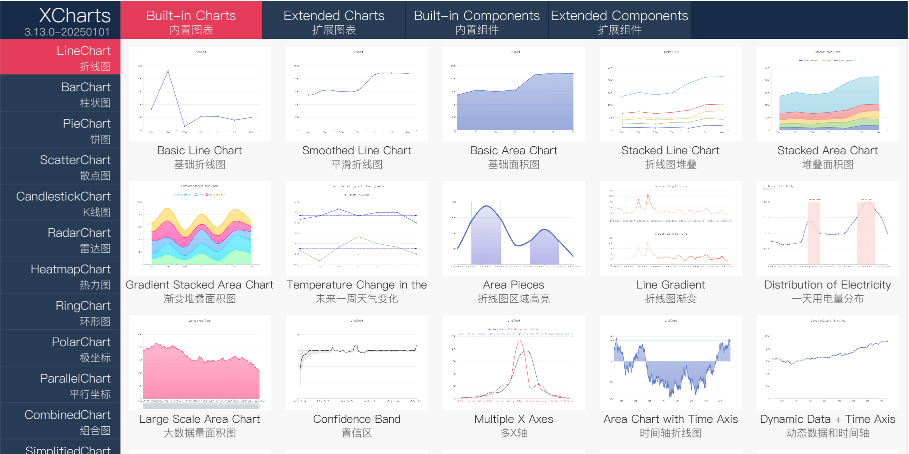
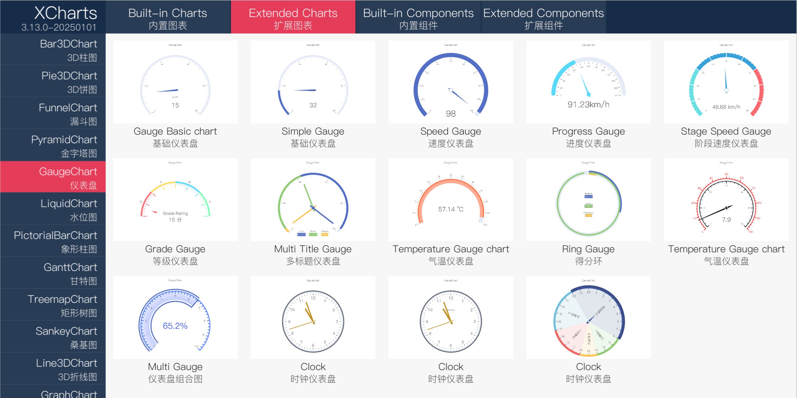

  <a href="">
    </img>
  </a>

<h2 align="center">XCharts</h2>

  A powerful, easy-to-use, configurable charting and data visualization library for Unity.
   
  Unity数据可视化图表插件。
   
  <a href="README-en.md">English README</a>

  <a href="https://github.com/XCharts-Team/XCharts/blob/master/LICENSE">
    </img>
  </a>
  <a href="https://github.com/XCharts-Team/XCharts/releases">
    </img>
  </a>
  <a href="https://github.com/XCharts-Team/XCharts">
    </img>
  </a>
  <a href="https://github.com/XCharts-Team/XCharts">
    </img>
  </a>
  <a href="https://xcharts-team.github.io/docs/tutorial01">
    </img>
  </a>
  <a href="https://xcharts-team.github.io/docs/tutorial01">
    </img>
  </a>

  <a href="https://github.com/XCharts-Team/XCharts/stargazers">
    </img>
  </a>
  <a href="https://github.com/XCharts-Team/XCharts/forks">
    </img>
  </a>
  <a href="https://github.com/XCharts-Team/XCharts/issues">
    </img>
  </a>

一款基于`UGUI`的功能强大的简单易用的`Unity`数据可视化图表插件。支持`折线图`、`柱状图`、`饼图`、`雷达图`、`散点图`、`热力图`、`环形图`、`K线图`、`极坐标`、`平行坐标`等十几种内置图表，以及`3D饼图`、`3D柱图`、`3D金字塔`、`漏斗图`、`仪表盘`、`水位图`、`象形柱图`、`甘特图`、`矩形树图`、`桑基图`、`3D折线图`、`关系图`等十几种扩展图表。

[XCharts 官方主页](https://xcharts-team.github.io)  
[XCharts 在线示例](https://xcharts-team.github.io/examples)  

[XCharts 教程：5分钟上手 XCharts](Documentation~/zh/tutorial01.md)  
[XCharts API文档](Documentation~/zh/api.md)  
[XCharts 常见问题](Documentation~/zh/faq.md)  
[XCharts 配置项手册](Documentation~/zh/configuration.md)  
[XCharts 更新日志](Documentation~/zh/changelog.md)  
[XCharts 订阅服务](Documentation~/zh/support.md)  

## 特性

- __纯代码绘制__：图表纯代码绘制，无需额外的贴图和Shader资源。
- __可视化配置__：参数可视化配置，效果实时预览，支持运行时代码动态修改配置和数据。
- __高自由定制__：支持从主题和配置参数上任意调整；支持代码自定义绘制，自定义回调以及自定义实现图表。
- __多内置图表__：支持线图、柱状图、饼图、雷达图、散点图、热力图、环形图、K线图、极坐标、平行坐标等多种内置图表。
- __多扩展图表__：支持3D柱图、3D饼图、漏斗图、金字塔、仪表盘、水位图、象形柱图、甘特图、矩形树图、桑基图、3D折线图、关系图等多种扩展图表。
- __多扩展组件__：支持表格、统计数值等多种扩展UI组件。
- __多图表组合__：支持内置图表的任意组合，同一图中可同时显示多个相同或不同类型的图表。
- __多种坐标系__：支持直角坐标系、极坐标系、单轴等多种坐标系。
- __丰富的组件__：支持标题、图例、提示框、标线、标域、数据区域缩放、视觉映射等常用组件。
- __多样式线图__：支持直线图、曲线图、虚线图、面积图、阶梯线图等多种线图。
- __多样式柱图__：支持并列柱图、堆叠柱图、堆积百分比柱图、斑马柱图、胶囊柱图等多种柱状图。
- __多样式饼图__：支持环形图、玫瑰图、环形玫瑰图等多种饼图。
- __丰富的线条__：支持实线、曲线、阶梯线、虚线、点线、点划线、双点划线等线条。
- __自定义绘制__：支持自定义图表内容绘制，提供绘制点、线、面等其他图形的强大的绘图API。
- __大数据绘制__：支持万级大数据量绘制；支持采样绘制；特殊的简化图表支持更优的性能。
- __自定义主题__：支持主题定制、导入和导出，内置明暗两种默认主题。
- __动画和交互__：支持渐入动画、渐出动画、变更动画、新增动画、交互动画等多种动画；支持多平台的数据筛选、视图缩放、细节展示等交互操作。
- __第三方扩展__：支持无缝接入`TexMeshPro`和`New Input System`。
- __版本和兼容__：支持所有`5.6`以上的`Unity`版本；支持全平台运行。

## 截图

## 仓库

- __[XCharts](https://github.com/XCharts-Team/XCharts)__ XCharts核心功能，完全免费。
- __[XCharts-Daemon](https://github.com/XCharts-Team/XCharts-Daemon)__ XCharts守护程序，用于确保XCharts更新时的编译正常。非必须，但建议使用。
- __[XCharts-Demo](https://github.com/XCharts-Team/XCharts-Demo)__ XCharts官方示例，不包含扩展图表部分。订阅购买扩展图表后可导入示例。
- __[XCharts-Pro](https://github.com/XCharts-Team/XCharts-Pro)__ XCharts专业版，包含所有扩展图表和扩展组件。订阅SVIP后可访问使用。
- __[XCharts-Pro-Demo](https://github.com/XCharts-Team/XCharts-Pro-Demo)__ XCharts专业版官方示例，包含所有扩展图表和扩展组件的示例。订阅SVIP后可访问使用。
- __[XCharts-UI](https://github.com/XCharts-Team/XCharts-UI)__ XCharts的扩展UI组件。订阅VIP后可访问使用。
- __[XCharts-Bar3DChart](https://github.com/XCharts-Team/XCharts-Bar3DChart)__ XCharts扩展图表：3D柱图。订阅购买后可访问使用。
- __[XCharts-FunnelChart](https://github.com/XCharts-Team/XCharts-FunnelChart)__ XCharts扩展图表：漏斗图。订阅购买后可访问使用。
- __[XCharts-GanttChart](https://github.com/XCharts-Team/XCharts-GanttChart)__ XCharts扩展图表：甘特图。订阅购买后可访问使用。
- __[XCharts-GaugeChart](https://github.com/XCharts-Team/XCharts-GaugeChart)__ XCharts扩展图表：仪表盘。订阅购买后可访问使用。
- __[XCharts-LiquidChart](https://github.com/XCharts-Team/XCharts-LiquidChart)__ XCharts扩展图表：水位图。订阅购买后可访问使用。
- __[XCharts-PictorialBarChart](https://github.com/XCharts-Team/XCharts-PictorialBarChart)__ XCharts扩展图表：象形住图。订阅购买后可访问使用。
- __[XCharts-Pie3DChart](https://github.com/XCharts-Team/XCharts-Pie3DChart)__ XCharts扩展图表：3D饼图。订阅购买后可访问使用。
- __[XCharts-PyramidChart](https://github.com/XCharts-Team/XCharts-PyramidChart)__ XCharts扩展图表：3D金字塔。订阅购买后可访问使用。
- __[XCharts-TreemapChart](https://github.com/XCharts-Team/XCharts-TreemapChart)__ XCharts扩展图表：矩形树图。订阅购买后可访问使用。
- __[XCharts-SankeyChart](https://github.com/XCharts-Team/XCharts-SankeyChart)__ XCharts扩展图表：桑基图。订阅购买后可访问使用。
- __[XCharts-Line3DChart](https://github.com/XCharts-Team/XCharts-Line3DChart)__ XCharts扩展图表：3D折线图。订阅购买后可访问使用。
- __[XCharts-GraphChart](https://github.com/XCharts-Team/XCharts-GraphChart)__ XCharts扩展图表：关系图。订阅购买后可访问使用。

## 分支

- __[master](https://github.com/XCharts-Team/XCharts/tree/master)__ XCharts3.0的开发分支。最新的修改和功能都先提交到`master`分支，稳定后再发布`release`版本。
- __[3.0](https://github.com/XCharts-Team/XCharts/tree/3.0)__ XCharts3.0的稳定分支。一般一个月一发布，`master`分支稳定后，`merge`到`3.0`分支，并发布`release`版本。
- __[2.0](https://github.com/XCharts-Team/XCharts/tree/2.0)__ XCharts2.0的稳定分支。带Demo，目前基本不再维护，仅修改严重bug。
- __[2.0-upm](https://github.com/XCharts-Team/XCharts/tree/2.0-upm)__ XCharts2.0的稳定UMP分支。不带Demo，只包含Package部分，不再维护。
- __[1.0](https://github.com/XCharts-Team/XCharts/tree/1.0)__ XCharts1.0的稳定分支。带Demo，不再维护。
- __[1.0-upm](https://github.com/XCharts-Team/XCharts/tree/1.0-upm)__ XCharts1.0的稳定UMP分支。不带Demo，不再维护。

## 使用

- 导入`XCharts`的`unitypackage`或者源码到项目。建议也导入`XCharts`守护程序 [XCharts-Daemon](https://github.com/XCharts-Team/XCharts-Daemon)。
- 在`Hierarchy`视图下右键选择`XCharts->LineChart`，即可创建一个默认的折线图。
- 用`Inspector`视图下的`Add Serie`和`Add Main Component`按钮可以添加`Serie`和`组件`。
- 在`Inspector`视图下可以调整各个组件的参数，`Game`视图可看到实时效果。
- 更多细节，请看[【XCharts教程：5分钟上手教程】](Documentation~/zh/tutorial01.md)。
- 首次使用，建议先认真看一遍教程。

## 注意

- __XCharts3.0不完全兼容XCharts2.0版本。__ 升级`3.0`时，部分代码和配置可能需要重新调整。建议旧项目可以继续使用`XCharts2.0`，新项目推荐使用`XCharts3.0`。
- __XCharts2.0只维护不加新功能。__ `2.0`只修复严重`bug`，原则上不再加新功能。
- __XCharts支持Unity 5.6及以上版本。__ 但由于版本测试有限难免疏漏，发现问题可提`Issue`。
- __本仓库只包含XCharts源码，不包含Demo示例部分。__ 需要查看`Demo`示例源码请到[XCharts-Demo](https://github.com/XCharts-Team/XCharts-Demo)仓库。也可以在浏览器查看运行效果 [在线Demo](https://xcharts-team.github.io/examples/) 。

## FAQ

- __XCharts可以免费使用吗？__ 
`XCharts`使用`MIT`协议，可以免费使用。也可以订阅`VIP`享受更多增值服务。

- __XCharts支持代码动态添加和修改数据吗？支持从`Excel`或数据库中获取数据吗？__ 
`XCharts`提供了各种数据操作的接口，支持代码动态修改配置，添加和修改数据，但数据来源需要自己解析和获取，再调用`XCharts`的接口添加到图表。

- __XCharts除了用在Unity平台，还能用在Winform或WPF等平台吗？__  
`XCharts`只支持在`Unity`平台使用。理论上任何支持`UGUI`的`Unity`版本都能运行`XCharts`。

- __锯齿怎么解决？支持多大量级的数据？__  
`XCharts`是基于`UGUI`实现的，所以`UGUI`中碰到的问题，在`XCharts`中也会存在。比如锯齿问题，比如`Mesh`顶点数超`65535`的问题。这两个问题的解决可参考[问答16](Documentation~/zh/faq.md)和[问答27](Documentation~/zh/faq.md)。  
由于`Mesh`的`65535`顶点数的限制，目前`XCharts`的单条`Line`支持约`2万`的数据量，当然开启采样可以支持更多数据的绘制，但同时也会更消耗CPU。

## 日志

- 各版本的详细更新日志请查看 [更新日志](Documentation~/zh/changelog.md)  

## Licenses

- [MIT License](https://github.com/XCharts-Team/XCharts/blob/master/LICENSE.md)
- 可免费商用，可二次开发。
- 扩展图表和高级功能部分需购买使用授权。

## 订阅

- `XCharts`核心库是开源的，可免费使用的。在此基础上，我们也提供多种订阅服务以满足不同用户的需求，订阅详情[☞ 请看这里](Documentation~/zh/support.md)。
- 订阅不是必须的，不影响`XCharts`的核心功能使用。
- 订阅是按年付费，订阅到期后，不要求必须续订，但中断订阅期间无法享受技术更新和支持等服务。

## 其他

- 邮箱：`monitor1394@gmail.com`  
- QQ群：XCharts交流群（`202030963`）  
- VIP群：XCharts VIP群（`867291970`）  
- 捐助、合作、订阅和技术支持：[☞ 请看这里](Documentation~/zh/support.md)
