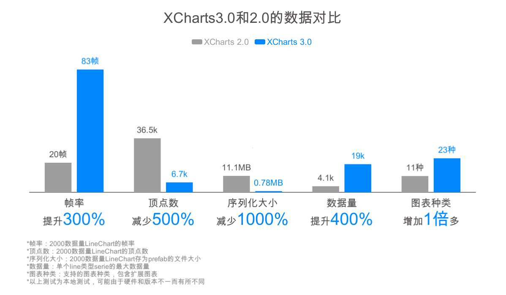

  

<h2 align="center">XCharts</h3>

  A powerful, easy-to-use, configurable charting and data visualization library for Unity.
   
  Unity数据可视化图表插件。
   
  <a href="Documentation/README.md">English README</a>

  
  
  
  
  
  

  
  
  

一款基于`UGUI`的功能强大、易用、参数可配置的数据可视化图表插件。支持`折线图`、`柱状图`、`饼图`、`雷达图`、`散点图`、`热力图`、`环形图`、`K线图`、`极坐标`、`平行坐标`等十种内置图表，以及`3D饼图`、`3D柱图`、`3D金字塔`、`漏斗图`、`仪表盘`、`水位图`、`象形柱图`、`甘特图`、`矩形树图`等多种扩展图表。

[XCharts3.0 教程](Documentation/XChartsTutorial01-ZH.md)  
[XCharts3.0 API](Documentation/XChartsAPI-ZH.md)  
[XCharts3.0 问答](Documentation/XChartsFAQ-ZH.md)  
[XCharts3.0 配置项手册](Documentation/XChartsConfiguration-ZH.md)  
[XCharts3.0 更新日志](CHANGELOG.md)  
[XCharts3.0 订阅服务](Documentation/SUPPORT.md)  

## 特性

- 参数可视化配置，效果实时预览，纯代码绘制，无需额外资源。
- 支持折线图、柱状图、饼图、雷达图、散点图、热力图、环形图、K线图、极坐标、平行坐标等十种内置图表。
- 支持3D柱图、漏斗图、金字塔、仪表盘、水位图、象形柱图、甘特图、矩形树图等多种扩展图表。
- 支持直线图、曲线图、面积图、阶梯线图等折线图。
- 支持并列柱图、堆叠柱图、堆积百分比柱图、斑马柱图等柱状图。
- 支持环形图、玫瑰图等饼图。
- 支持内置图表的任意组合，同一图表中可同时显示多个相同或不同类型的图表。
- 支持实线、曲线、阶梯线、虚线、点线、点划线、双点划线等线条。
- 支持主题定制、导入和导出，内置两种默认主题。
- 支持自定义图表内容绘制，提供绘制点、直线、曲线、三角形、四边形、圆形、环形、扇形、边框、箭头等强大的绘图API。
- 支持PC端和手机端上的数据筛选、视图缩放、细节展示等交互操作。
- 支持万级大数据绘制。
- 支持`TexMeshPro`。

## 截图

更多示例请看 [XCharts-Demo](https://github.com/XCharts-Team/XCharts-Demo) 仓库，也可以在浏览器查看`WebGL`下的运行效果 [在线Demo](https://xcharts-team.github.io/demo/) 。

## `XCharts3.0`

- 增加`Time`时间轴。
- 增加`SingleAxis`单轴。
- 增加多种坐标系：`Grid`、`Polar`、`Radar`、`SingleAxis`。
- 增加多种动画方式。
- 增加多种图表交互。
- 增加国际化支持。
- 增加`Widgets`小组件。
- 增加多种扩展图表。

## `XCharts3.0` 相比 `XCharts2.0`

- 更健壮的底层框架。
- 更强大的性能。
- 更小的序列化文件。
- 更好的交互体验。
- 更多的组件支持。
- 更强大的文本自述能力。
- 更合理的组件调整。
- 更灵活的组件插拔。
- 更高效的二次开发。
- 更丰富的Demo示例。

## 注意

- `XCharts3.0` 不完全兼容 `XCharts2.0` 版本，建议旧项目可以继续使用`XCharts2.0`，新项目推荐使用`XCharts3.0`。
- `XCharts2.0` 进入维护阶段，后续只修复严重`bug`，理论上不再加新功能。
- `XCharts` 理论上支持`Unity 5.6`及以上版本，但由于版本测试有限难免疏漏，发现版本兼容问题可提`Issue`。
- 本仓库只包含`XCharts`源码，不包含`Demo`示例部分。需要查看`Demo`示例请到[XCharts-Demo](https://github.com/XCharts-Team/XCharts-Demo)仓库。

## 使用

1. 导入`XCharts`的`unitypackage`或者源码到项目。
2. 在`Hierarchy`视图下右键选择`XCharts->LineChart`，即可创建一个默认的折线图。
3. 在`Inspector`视图可以调整各个组件的参数，并在`Game`视图看到实时效果。

更多教程请看：[XCharts教程：5分钟上手教程](Documentation/XChartsTutorial01-ZH.md)

首次使用，建议认真看一遍教程。

## FAQ

1. `XCharts`可以免费使用吗？  
   答：`XCharts`使用`MIT`协议，可以免费使用。也可以订阅`VIP`享受更多增值服务。

2. `XCharts`支持代码动态添加和修改数据吗？支持从`Excel`或数据库中获取数据吗？  
   答：支持代码动态添加和修改数据，但数据需要自己解析或获取，再调用`XCharts`的接口添加到`XCharts`。

3. 这个插件除了用在`Unity`，还能用在其他平台（如`Winform`或`WPF`）吗？  
   答：目前只支持在`Unity`平台使用。理论上任何支持`UGUI`的`Unity`版本都能运行`XCharts`。

## Licenses

[MIT License](LICENSE.md)

可免费商用，可二次开发

## 日志

[更新日志](CHANGELOG.md)  

## 其他

邮箱：`monitor1394@gmail.com`  
QQ群：XCharts交流群（`202030963`）  
VIP群：XCharts技术支持VIP群（`867291970`）  
捐助、合作和技术支持：[☞ 看这里](Documentation/SUPPORT.md)
