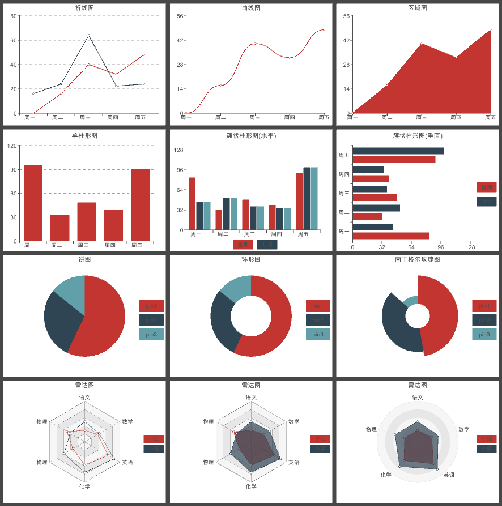
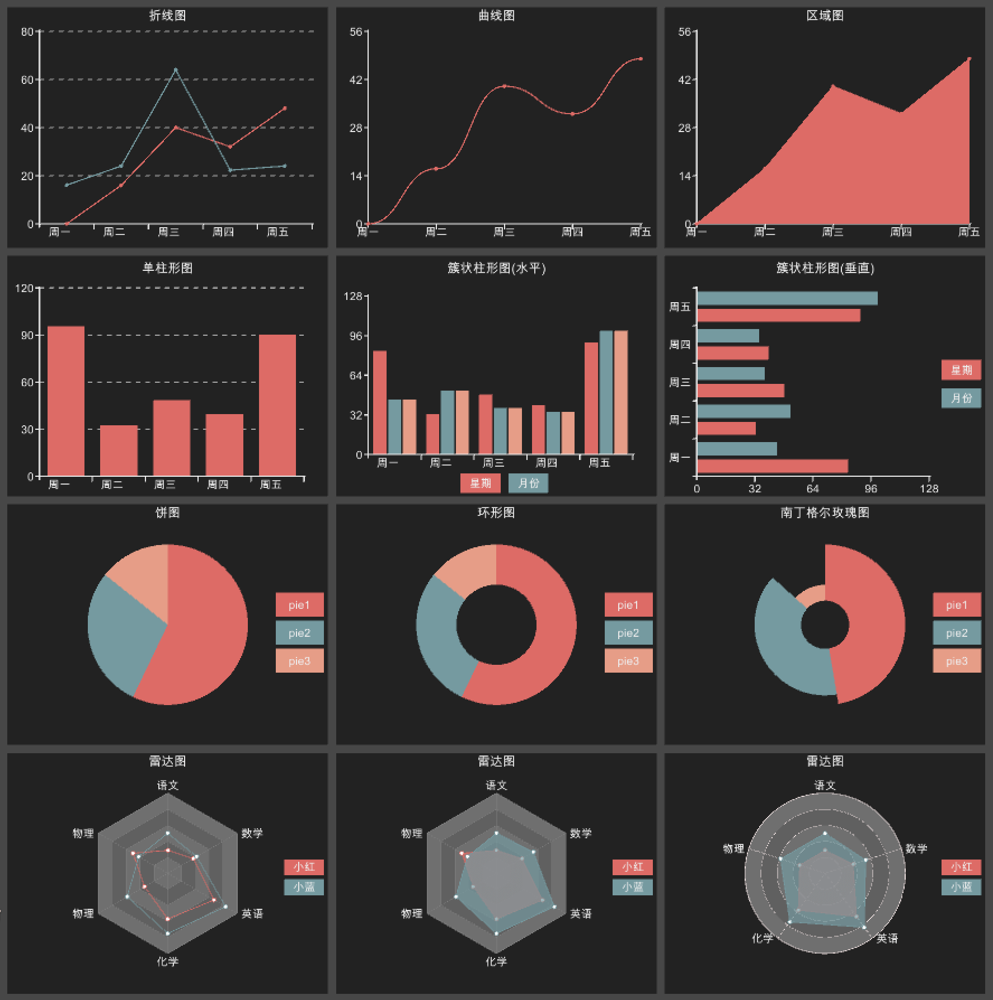

# XCharts
A Simple UGUI Charting Library for Unity

# 特性
  1. 支持折线图(`LineChart`)、柱状图(`BarChart`)、饼图(`PieChart`)、雷达图(`RadarChart`)等
  2. 支持`Default`、`Light`、`Dark`三种主题切换
  3. 参数可视化配置，效果实时预览
  4. 折线图通过参数可配置出：折线图、曲线图、区域图等
  5. 饼图通过参数可配置出：饼图、环形图、南丁格尔玫瑰图等

# TODO
  1. `tooltip`
  2. 旭日图`sunburst`
  3. 动画效果

# 效果图
  1.`Default`主题

  2.`Light`主题

  3.`Dark`主题

# 配置项手册
* `Theme` 主题
   + `theme`：主题，`Default`、`Light`、`Dark`三种可选主题
   + `themeInfo`：各主题对应的默认配置，也可自己调整
* `Title` 标题
   + `show`：是否显示标题，标题默认现象在顶部
   + `text`：标题内容
   + `align`：对齐方式，`Left`、`Right`、`Center`三种可选对齐方式
   + `left`：左偏移量
   + `right`：右偏移量
   + `top`：顶部偏移量
   + `bottom`：低部偏移量
* `Legend` 图例
   + `show`：是否显示图例
   + `location`：图例显示在的位置，可选`Left`、`Right`、`Top`、`Bottom`四个位置
   + `itemWidth`：图例标记的图形宽度
   + `itemHeight`：图例标记的图形高度
   + `itemGap`：图例每项之间的间隔。横向布局时为水平间隔，纵向布局时为纵向间隔。
   + `left`：左偏移量
   + `right`：右偏移量
   + `top`：顶部偏移量
   + `bottom`：低部偏移量
   + `dataList`：图例的数据数组
     - `show`：是否显示该图例对应的数据
     - `key`：图例的`key`，和对应数据匹配
     - `text`：图例的显示名字
* `Coordinate` 坐标系
  + `show`：是否显示坐标系
  + `left`：左偏移量
  + `right`：右偏移量
  + `top`：顶部偏移量
  + `bottom`：低部偏移量
  + `tickness`：坐标轴线的粗细
  + `splitWidth`：坐标刻度的长度
* `XAxis` X坐标轴
  + `type`：坐标轴类型。可选：
    - `value` 数值轴，适用于连续数据。
    - `category` 类目轴，适用于离散的类目数据，为该类型时必须通过 data 设置类目数据。
  + `splitNumber`：分割段数
  + `maxSplitNumber`：最大分割段数，当data的数据大于该值时，会删除第一个data数据再添加
  + `showSplitLine`：是否显示分割线
  + `splitLineType`：分割线线的类型，可选：
    - `solid`：实线
    - `dashed`：虚线
    - `dotted`：点
  + `boundaryGap`：坐标轴两边是否留白。默认为 true，这时候刻度只是作为分隔线，标签和数据点都会在两个刻度之间的带(`band`)中间。
  + `data`：类目数据，在类目轴（`type`: `'category'`）中有效。
* `YAxis` Y坐标轴，配置同`XAxis`
* `SeriesList` 系列列表数据，和图例对应
  + `legendKey`：对应的图例`key`
  + `showDataNumber`：显示数据个数，默认为`0`全部显示
  + `dataList`：`SeriesData`数据项
    - `key`：key
    - `value`：value

