<p align="center">
  <a href="">
    
  </a>
</p>
<h2 align="center">XCharts</h3>
<p align="center">
  A powerful, easy-to-use, configurable charting and data visualization library for Unity.
  <br>
  一款基于UGUI的数据可视化图表插件。
  <br>
  <a href="Assets/XCharts/README.md">English Doc</a>
</p>
<p align="center">
  <a href="https://github.com/monitor1394/unity-ugui-XCharts/blob/master/LICENSE">
    
  </a>
  <a href="https://github.com/monitor1394/unity-ugui-XCharts/releases">
    
  </a>
  <a href="">
    
  </a>
  <a href="">
    
  </a>
  <a href="">
    
  </a>
  <a href="">
    
  </a>
</p>
<p align="center">
  <a href="">
    
  </a>
  <a href="">
    
  </a>
  <a href="">
    
  </a>
</p>

一款基于`UGUI`的功能强大、易用、参数可配置的数据可视化图表插件。支持折线图、柱状图、饼图、雷达图、散点图、热力图、仪表盘、环形图、极坐标、水位图、K线图等常见图表。

[XCharts问答](https://github.com/monitor1394/unity-ugui-XCharts/blob/master/Assets/XCharts/Documentation/XCharts问答.md)  
[XChartsAPI手册](https://github.com/monitor1394/unity-ugui-XCharts/blob/master/Assets/XCharts/Documentation/XChartsAPI.md)  
[XCharts配置项手册](https://github.com/monitor1394/unity-ugui-XCharts/blob/master/Assets/XCharts/Documentation/XCharts配置项手册.md)  
[XCharts更新日志](https://github.com/monitor1394/unity-ugui-XCharts/blob/master/Assets/XCharts/CHANGELOG.md)  
[教程：5分钟上手XCharts](https://github.com/monitor1394/unity-ugui-XCharts/blob/master/Doc/教程：5分钟上手XCharts.md)  

## XCharts 2.0

* 底层重构，分层绘制，优化可扩展性，支持更多数据。
* 支持多组件模式。
* 支持大部分图表的任意组合。
* 支持主题定制、导入和导出，更多的主题配置参数。
* 支持全局配置参数调整。
* 支持自定义图表的快速定制。
* 新增 `TextMeshPro` 的支持。
* 新增 `CandlestickChart` K线图。
* __注意：__ `2.0` 版本进行了大量的重构和调整，并不完全兼容 `1.0` 版本，升级后部分参数设置可能被重置为默认值，请谨慎升级。

## 特性

* 内置丰富示例和模板，参数可视化配置，效果实时预览，纯代码绘制。
* 支持折线图、柱状图、饼图、雷达图、散点图、热力图、热力图、仪表盘、环形图、极坐标、水位图等十种常见图表。
* 支持直线图、曲线图、面积图、阶梯线图等折线图。
* 支持并列柱图、堆叠柱图、堆积百分比柱图、斑马柱图等柱状图。
* 支持环形图、玫瑰图等饼图。
* 支持大部分图表的任意组合，同一图表中可同时显示多个相同或不同类型的图表。
* 支持实线、曲线、阶梯线、虚线、点线、点划线、双点划线等线条。
* 支持主题定制、导入和导出，内置三种默认主题。
* 支持自定义图表内容绘制，提供绘制点、直线、曲线、三角形、四边形、圆形、环形、扇形、边框、箭头等绘图API。
* 支持PC端和手机端上的数据筛选、视图缩放、细节展示等交互操作。
* 支持万级大数据绘制。
* 支持`TexMeshPro`。

## 截图

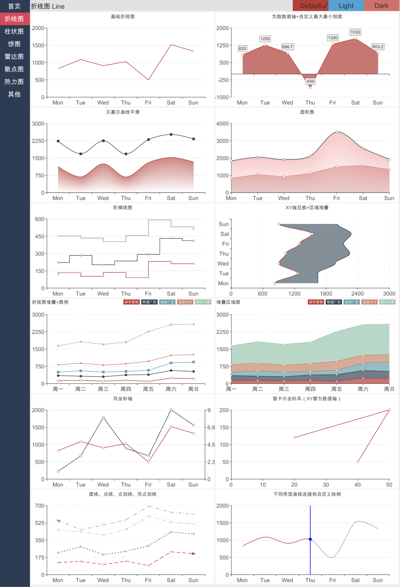
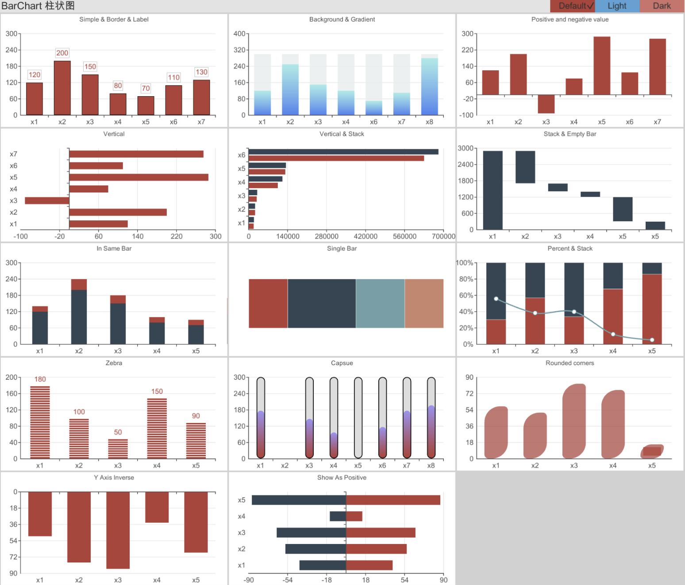
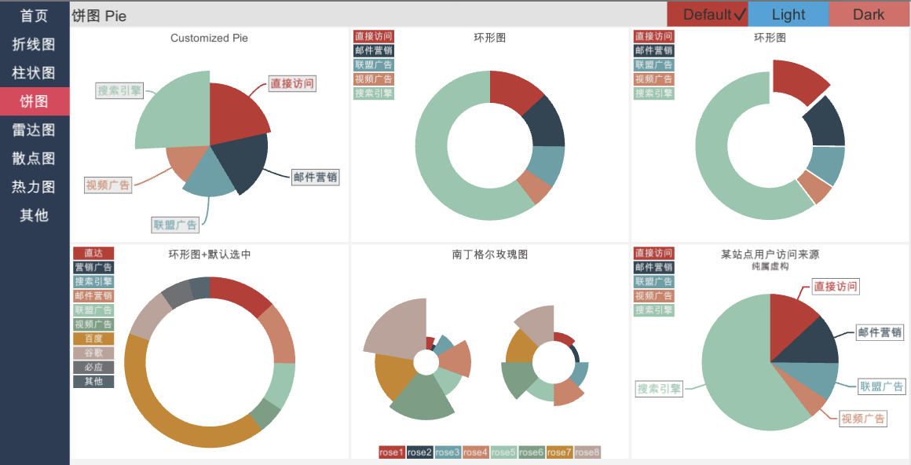
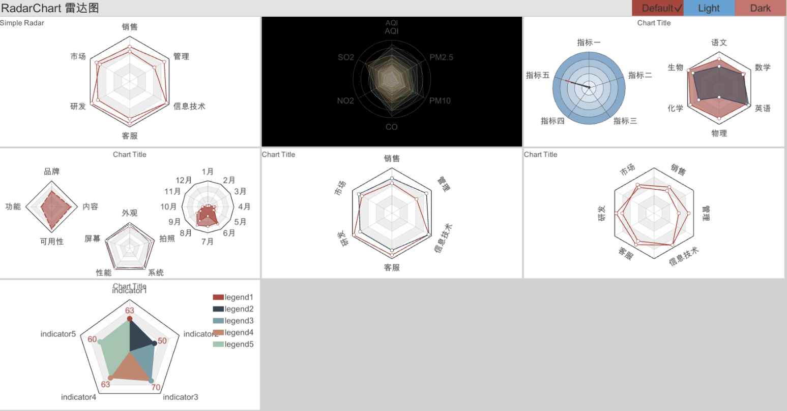
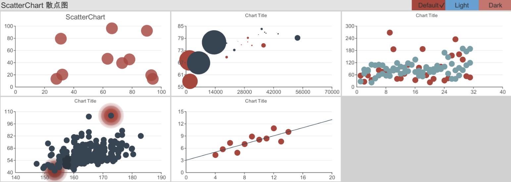
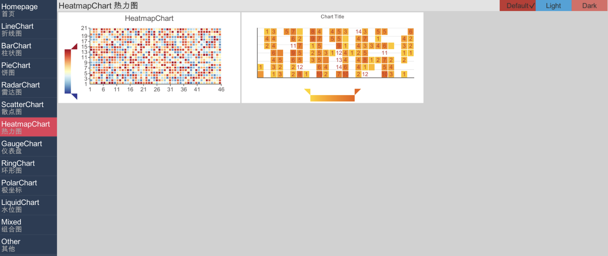
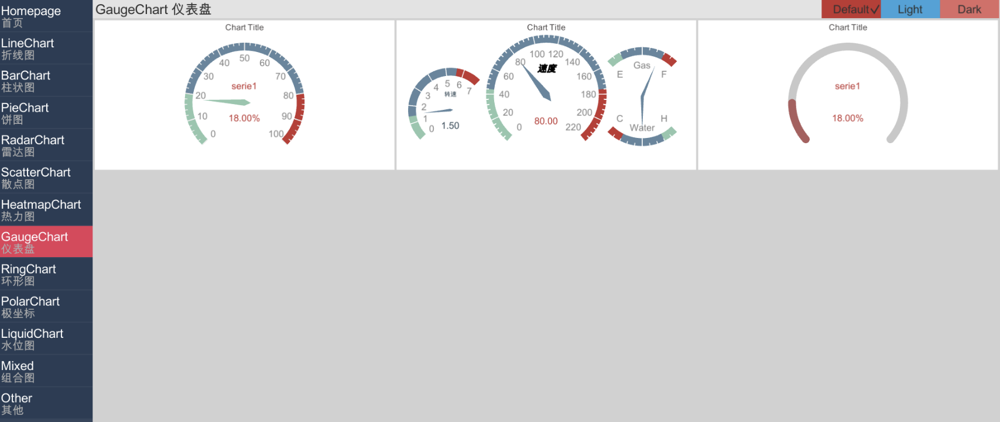
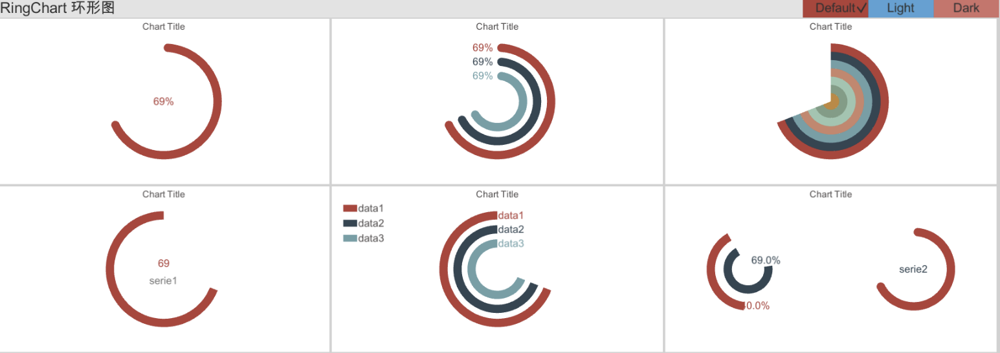
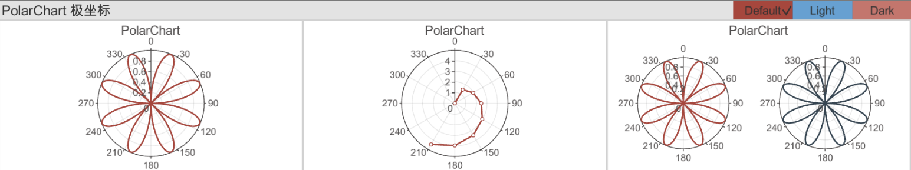
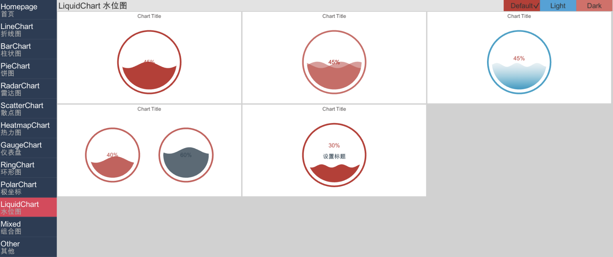
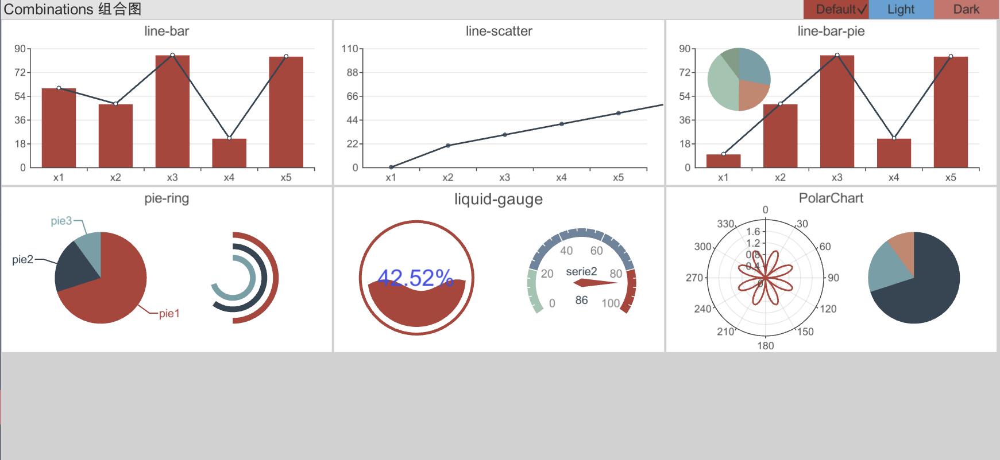

## 术语

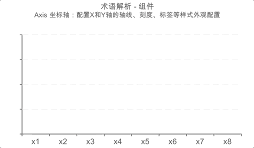

XCharts的图表由组件和数据组成。不同的组件和数据可以组合成不同类型的图表。组件分为主组件和子组件，主组件包含子组件。  

## 组件

| | |
| ---| --|
| Theme | 主题组件 |
| Title | 标题组件 |
| Legend | 图例组件 |
| Grid | 网格组件 |
| Axis | 坐标轴组件 |
| Series | 系列组件 |
| Tooltip | 提示框组件 |
| DataZoom | 区域缩放组件 |
| VisualMap | 视觉映射组件 |
| Radar | 雷达组件 |
| Settings | 全局设置组件 |

## 图表

| | |
| ---| --|
| LineChart | 这线图 |
| BarChart | 柱状图 |
| PieChart | 饼图 |
| RadarChart | 雷达图 |
| ScatterChart | 散点图 |
| HeatmapChart | 热力图 |
| GuageChart | 仪表盘 |
| RingChart | 环形图 |
| LiquidChart | 水位图 |
| PolarChart | 极坐标图 |
| CandlestickChart | K线图 |

## 关系

以下是LineChart折线图和主组件、子组件的关系结构：

``` js
.
├── LineChart
.   ├── ThemeInfo
    ├── Title
    │   └── Location
    ├── Legend
    │   └── Location
    ├── Tooltip
    ├── DataZoom
    ├── VisualMap
    ├── Grid
    ├── Axis
    │   ├── AxisLine
    │   ├── AxisName
    │   ├── AxisLabel
    │   ├── AxisTick
    │   └── AxisSplitArea
    ├── Series
    │   ├── ItemStyle
    │   ├── AreaStyle
    │   ├── SerieSymbol
    │   ├── LineStyle
    │   ├── LineArrow
    │   ├── SerieLabel
    │   ├── Emphasis
    │   ├── Animation
    │   └── SerieData
    └── Settings
```

## 使用

* 本项目在`Unity 2017.4.27f1`和`.Net 3.5`下开发，在 `Unity 5`、`Unity 2018`、`Unity 2019`上测试正常。理论上可运行于任何支持`UGUI`的`Unity`版本。
* 通过下载源码或`unitypackage`包导入到你的项目中。
* 如果你是`2018.3`及以上版本，可通过`Package Manager`的`Git`来导入包（`2.0-upm`分支对应的`Release`版本，更新速度较慢，但相对更稳定）：
  1. 打开`Packages`目录下的`manifest.json`文件，在`dependencies`下加入以下内容（或者通过`Package Manager`的`Add package from git URL...`）：  
  ``` json
  "com.monitor1394.xcharts": "https://github.com/monitor1394/unity-ugui-XCharts.git#2.0-upm",
  ```
  2. 回到`Unity`，可能会花3到5分钟进行下载和编译，成功后就可以开始使用`XCharts`了。
  3. 如果要删除`XCharts`，删除掉1步骤所加的内容即可。
  4. 如果要更新`XCharts`，删除`manifest.json`文件的`lock`下的`com.monitor1394.xcharts`相关内容即会从新下载编译。在 `Component -> XCharts -> Upgrade Check`可以检测是否有新版本可更新。
  5. __注意：__ 通过这种方式导入要求本地先装有`Git`。

* 在Editor上快速创建一个图表：

  1. 在`Hierarchy`试图下右键或菜单栏`GameObject`下拉：`XCharts->LineChart`，即可快速创建一个简单的折线图出来。
  2. `Inspector` 视图下可以调整各个组件的参数，`Game` 视图会实时反馈调整的效果。各个组件的详细参数说明可查阅[XCharts配置项手册](https://github.com/monitor1394/unity-ugui-XCharts/blob/master/Assets/XCharts/Documentation/XCharts配置项手册.md)。

* 更多的代码动态控制的例子请参考[教程：5分钟上手XCharts](https://github.com/monitor1394/unity-ugui-XCharts/blob/master/Doc/教程：5分钟上手XCharts.md)  。

## 文档

* 常见问题看这里☞ [XCharts问答](https://github.com/monitor1394/unity-ugui-XCharts/blob/master/Assets/XCharts/Documentation/XCharts问答.md)  
* 接口文档看这里☞ [XChartsAPI手册](https://github.com/monitor1394/unity-ugui-XCharts/blob/master/Assets/XCharts/Documentation/XChartsAPI.md)  
* 参数配置看这里☞ [XCharts配置项手册](https://github.com/monitor1394/unity-ugui-XCharts/blob/master/Assets/XCharts/Documentation/XCharts配置项手册.md)  
* 更新日志看这里☞ [XCharts更新日志](https://github.com/monitor1394/unity-ugui-XCharts/blob/master/Assets/XCharts/CHANGELOG.md)  
* 新手教程看这里☞ [教程：5分钟上手XCharts](https://github.com/monitor1394/unity-ugui-XCharts/blob/master/Doc/教程：5分钟上手XCharts.md)  

## 日志

[更新日志](https://github.com/monitor1394/unity-ugui-XCharts/blob/master/Assets/XCharts/CHANGELOG.md)  

## Licenses

[MIT License](https://github.com/monitor1394/unity-ugui-XCharts/blob/master/Assets/XCharts/LICENSE.md)

## 其他

邮箱：monitor1394@gmail.com  
QQ群：XCharts交流群（`202030963`）  
VIP群：XCharts技术支持VIP群（`867291970`）  
捐助和技术支持：[☞ 看这里](SUPPORT.md)
