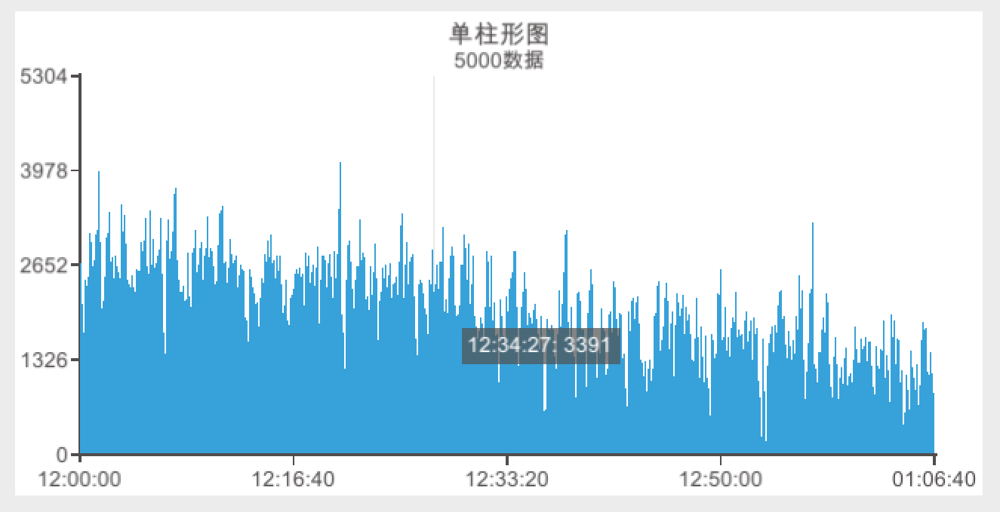

# XCharts
A Simple UGUI Charting Library for Unity
 
UGUI图表库，风格参考了[`ECharts`](https://www.echartsjs.com/examples/#chart-type-bar)

# 特性
  1. 内置丰富示例，参数可视化配置，效果实时预览，纯源码绘制
  2. 支持折线图（`LineChart`）、柱状图（`BarChart`）、饼图（`PieChart`）、雷达图（`RadarChart`）等常用图表
  3. 支持`Default`、`Light`、`Dark`三种默认主题切换，自定义主题
  4. 支持多数据密集图表
  5. 折线图通过参数可配置出：折线图、曲线图、面积图等
  6. 饼图通过参数可配置出：饼图、环形图、南丁格尔玫瑰图等

# 内置示例
  * 折线图
    1. 基础折线图
    2. 负数数值轴+自定义最大最小刻度
    3. XY轴互换
    4. XY轴互换+区域堆叠
    5. 贝塞尔曲线平滑
    6. 折线图堆叠+图例
    7. 堆叠区域图
    8. 面积图
    9. 动态数据
    10. 大数据量面积图
  * 柱状图
    1. 基础柱状图
    2. 负数数值轴+自定义最大最小刻度
    3. XY轴互换
    4. 坐标轴刻度与标签对齐
    5. 世界人口总量
    6. 堆叠条形图
    7. 深圳月最低生活费组成（单位:元）
    8. 5000数据
  * 饼图
    1. Customized Pie
    2. 环形图
    3. 南丁格尔玫瑰图
    4. 某站点用户访问来源
    5. 用代码添加和更新数据
  * 雷达图
    1. 多边形雷达图+指定最大值
    2. 圆形+自定义背景
    3. 填充颜色
  * 其他

# 更新日志
  * （2019.05.24）增加`堆叠区域图`
  * （2019.05.16）`Value`类型的坐标轴可以设置`AxisMinMaxType`控制最大最小刻度
  * （2019.05.15）完善数据接口
  * （2019.05.14）`LineChart`和`BarChart`的X轴支持`AxisType.Value`模式
  * （2019.05.13）增加负数数值轴支持
  * （2019.05.11）增加自定义`Editor`编辑
  * （2019.03.21）增加`Tooltip`
  * （2018.11.01）增加`Default`、`Light`、`Dark`三种默认主题
  * （2018.09.05）0.1版本

# 效果图
  1.`Default`主题

  2.`Light`主题

  3.`Dark`主题

  4.多数据支持

# 配置项手册
* `Theme` 主题
   + `theme`：主题，`Default`、`Light`、`Dark`三种可选主题
   + `themeInfo`：各主题对应的默认配置，也可自己调整
* `Title` 标题
   + `show`：是否显示标题，标题默认现象在顶部
   + `text`：标题内容
   + `align`：对齐方式，`Left`、`Right`、`Center`三种可选对齐方式
   + `left`：左偏移量
   + `right`：右偏移量
   + `top`：顶部偏移量
   + `bottom`：低部偏移量
* `Legend` 图例
   + `show`：是否显示图例
   + `location`：图例显示在的位置，可选`Left`、`Right`、`Top`、`Bottom`四个位置
   + `itemWidth`：图例标记的图形宽度
   + `itemHeight`：图例标记的图形高度
   + `itemGap`：图例每项之间的间隔。横向布局时为水平间隔，纵向布局时为纵向间隔。
   + `left`：左偏移量
   + `right`：右偏移量
   + `top`：顶部偏移量
   + `bottom`：低部偏移量
   + `dataList`：图例的字符串数据数组
* `Coordinate` 坐标系
  + `show`：是否显示坐标系
  + `left`：左偏移量
  + `right`：右偏移量
  + `top`：顶部偏移量
  + `bottom`：低部偏移量
  + `tickness`：坐标轴线的粗细
  + `splitWidth`：坐标刻度的长度
* `XAxis` X坐标轴
  + `type`：坐标轴类型。可选：
    - `value` 数值轴，适用于连续数据。
    - `category` 类目轴，适用于离散的类目数据，为该类型时必须通过 data 设置类目数据。
  + `splitNumber`：分割段数
  + `maxSplitNumber`：最大分割段数，当data的数据大于该值时，会删除第一个data数据再添加
  + `showSplitLine`：是否显示分割线
  + `splitLineType`：分割线线的类型，可选：
    - `solid`：实线
    - `dashed`：虚线
    - `dotted`：点
  + `boundaryGap`：坐标轴两边是否留白。默认为 true，这时候刻度只是作为分隔线，标签和数据点都会在两个刻度之间的带(`band`)中间。
  + `data`：类目数据，在类目轴（`type`: `'category'`）中有效。
* `YAxis` Y坐标轴，配置同`XAxis`
* `SeriesList` 系列列表数据，和图例对应
  + `legendKey`：对应的图例`key`
  + `showDataNumber`：显示数据个数，默认为`0`全部显示
  + `dataList`：`float`型数据数组

